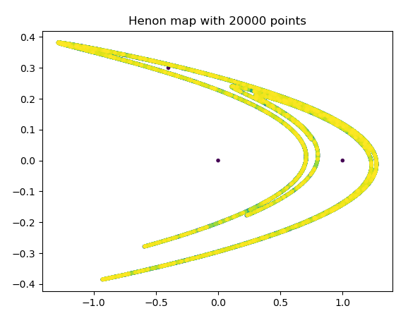
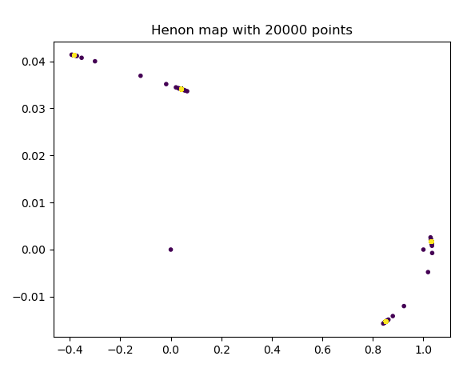

# henon-function
 A python simulator for the Henon Function
 
 

The Henon Function
==================

The Hénon map , sometimes called Hénon-Pomeau attractor/map, [1] is a discrete-time dynamical system. It is one of the most studied examples of dynamical systems that exhibit chaotic behavior. The Hénon map takes a point (xn, yn) in the plane and maps it to a new point

$${\begin{cases}x_{{n+1}}=1-ax_{n}^{2}+y_{n}\\y_{{n+1}}=bx_{n}.\end{cases}}$$
The map depends on two parameters, a and b, which for the classical Hénon map have values of a = 1.4 and b = 0.3. For the classical values the Hénon map is chaotic. For other values of a and b the map may be chaotic, intermittent, or converge to a periodic orbit. An overview of the type of behavior of the map at different parameter values may be obtained from its orbit diagram.

The map was introduced by Michel Hénon as a simplified model of the Poincaré section of the Lorenz model. For the classical map, an initial point of the plane will either approach a set of points known as the Hénon strange attractor, or diverge to infinity. The Hénon attractor is a fractal, smooth in one direction and a Cantor set in another. Numerical estimates yield a correlation dimension of 1.25 ± 0.02[2] and a Hausdorff dimension of 1.261 ± 0.003[3] for the attractor of the classical map.

From Wikipedia (https://en.wikipedia.org/wiki/H%C3%A9non_map)

 

Usage
=====

The script henon.py will generate a Henon map with the default values a = 1.4 and b = 0.3.

The script henonFunction.py will generate a Henon map with custom a and b values. You can use the functions within to generate attractors within other programs.

The script henonMoving.py will create a moving Henon map where the values of a and b steadily go down.

Dependencies
============

Python 3

Matplotlib

 